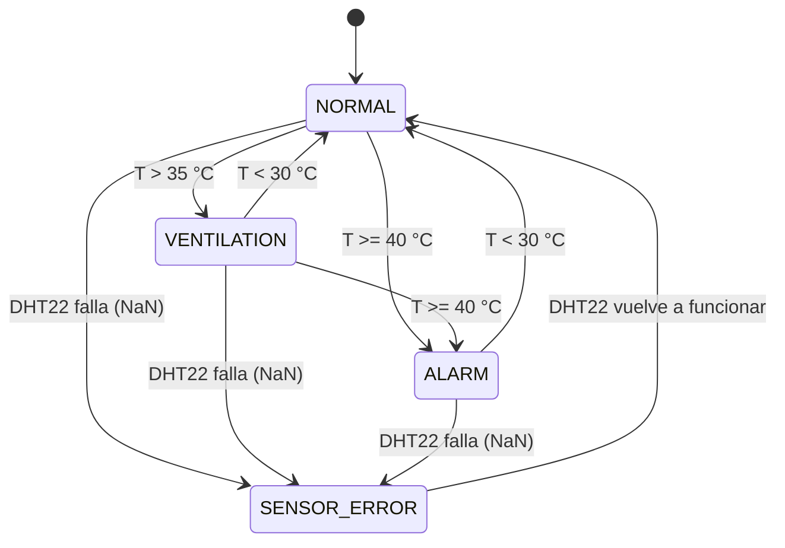
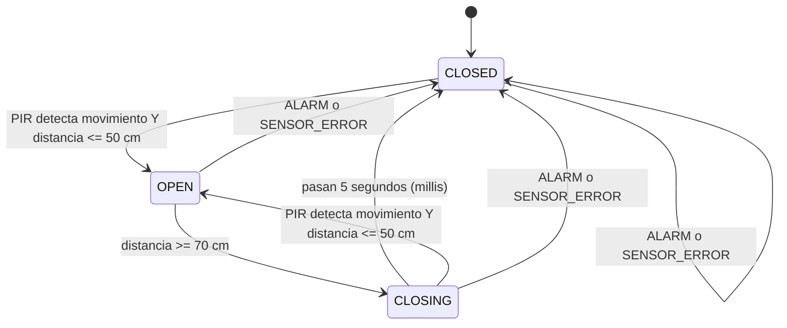

# Taller de Ingeniería de Software para Sistemas Embebidos

**Proyecto:** SmartRoomController

## 1. Solución de los Requisitos Funcionales

A continuación explico cómo implementé en el código cada uno de los 6 requisitos funcionales (RF) solicitados en el taller:

* **RF1 — Estado NORMAL:** 
  Creé un estado llamado `NORMAL` dentro de mi máquina de estados. Cuando el sistema está aquí (porque la temperatura es estable y no hay alarmas), programé la función `updateOutputs()` para que encienda únicamente el LED verde y mantenga los demás LEDs y el buzzer apagados. Por defecto, la puerta inicia cerrada.

* **RF2 — Detección de presencia:**
  En la máquina de estados de la puerta, agregué la condición para pasar de `CLOSED` a `OPEN`. Básicamente, si el sensor PIR detecta movimiento (`motionDetected == true`) y la distancia del sensor ultrasónico es `<= 50 cm`, mando a abrir el servomotor. Esto lo encerré en un `if` que primero verifica que no estemos en estado de alarma.

* **RF3 — Cierre automático (sin delay):**
  Para no bloquear el procesador con `delay(5000)`, usé la función `millis()`. Cuando la persona se aleja a `>= 70 cm`, la puerta entra en un estado llamado `CLOSING` y guardo el tiempo exacto en una variable (`closeStartTime = millis()`). El ciclo sigue corriendo sin detenerse, y solo cuando la resta `millis() - closeStartTime` llega a 5000 (5 segundos), la puerta finalmente pasa a `CLOSED`.

* **RF4 — Temperatura alta:**
  Si la temperatura leída por el DHT22 supera los 35 °C, el sistema cambia al estado `VENTILATION`. En este estado, el código apaga el LED verde y enciende el LED amarillo. En cuanto la temperatura baja de 30 °C, el sistema detecta el cambio y regresa automáticamente al estado `NORMAL`.

* **RF5 — Condición crítica:**
  Agregué una prioridad alta en el código: si en cualquier momento la temperatura llega o supera los 40 °C, se activa el estado `ALARM`. Aquí enciendo el LED rojo, el amarillo y el buzzer. Lo más importante es que en la función que controla la puerta (`updateDoor()`), agregué un bloqueo al inicio: si el sistema está en `ALARM`, la puerta pasa a `CLOSED` de inmediato y se ignora cualquier sensor de movimiento hasta que la temperatura baje de 30 °C.

* **RF6 — Cancelación del cierre:**
  Mientras la puerta está en el estado `CLOSING` (contando los 5 segundos), sigo leyendo los sensores. Si alguien vuelve a acercarse (PIR detecta movimiento y distancia <= 50 cm) antes de que se acabe el tiempo, el estado cambia de nuevo a `OPEN`. Al salir del estado `CLOSING`, el temporizador se cancela automáticamente y la puerta se queda abierta.

---

## 2. Diagramas de Máquinas de Estado

Para ordenar la lógica del código y evitar que las decisiones choquen entre sí, separé el funcionamiento en dos máquinas de estado principales: una para el sistema (clima/alarmas) y otra exclusiva para la puerta. A continuación, presento los diagramas contemplando **todos** los estados que programé.

### Máquina de Estados del Sistema (Control Principal)

Controla el clima, la seguridad del cuarto y las fallas del sensor. La alarma tiene prioridad.

### Máquina de Estados de la Puerta

Controla la apertura, cierre y el temporizador. Si se activa la alarma o hay error de sensor, la puerta se fuerza a cerrarse desde cualquier estado por seguridad.

---

## 3. Casos de Prueba

Realicé las siguientes pruebas simuladas para asegurar que los 6 requisitos se cumplan correctamente:

| Caso | Entrada / Condición simulada | Resultado esperado según el RF | Resultado obtenido en código |
| :---: | :--- | :--- | :--- |
| **1** | T = 25 °C, distancia = 100 cm, movimiento = NO | Estado NORMAL, LED verde encendido, demás apagados. Puerta cerrada. | Funciona correctamente |
| **2** | T = 37 °C | Estado VENTILATION. LED amarillo encendido. | Funciona correctamente |
| **3** | T = 42 °C | Estado ALARM. LED rojo y amarillo encendidos. Buzzer sonando. Puerta bloqueada cerrada. | Funciona correctamente |
| **4** | Movimiento = SÍ, distancia = 30 cm | La puerta se abre (pasa a estado OPEN). | Funciona correctamente |
| **5** | Persona se aleja (Distancia = 100 cm) | Inicia cuenta regresiva de 5 segundos. Luego se cierra. | Funciona correctamente |
| **6** | Distancia = 100 cm y a los 3 segundos la persona vuelve (30 cm + movimiento) | Se cancela el cierre, la puerta vuelve a estado OPEN. | Funciona correctamente |

---

## 4. Preguntas de Análisis

**1. ¿Qué problema produciría implementar el cierre de 5 segundos con `delay(5000)`?**  
Si uso `delay(5000)`, el ESP32 se quedaría totalmente "congelado" haciendo nada durante esos 5 segundos. El gran problema de esto es que el procesador no podría leer el sensor de temperatura en ese lapso. Si justo en esos 5 segundos hay un incendio y la temperatura sube a 42 °C, el sistema no se daría cuenta hasta que termine el delay, lo cual es súper peligroso. Además, sería imposible cancelar el cierre si alguien vuelve a acercarse.

**2. ¿Qué debe ocurrir si una persona está frente a la puerta al mismo tiempo que la temperatura alcanza 42 °C?**  
El sistema debe ignorar a la persona y cerrar la puerta de inmediato. Al programar, le di mayor prioridad a la alarma de 42 °C (riesgo crítico) que a la conveniencia de abrir la puerta. En el código, esto se maneja forzando el estado `CLOSED` si el sistema entra en `ALARM`.

**3. ¿Por qué el sensor debería proporcionar datos y no tomar directamente decisiones sobre los actuadores?**  
Porque las decisiones casi siempre dependen del contexto. Si el sensor ultrasónico abriera el servomotor directamente en cuanto ve a alguien a 30 cm, no habría forma de decirle "espera, hay un incendio, no la abras". Al separar los datos de las decisiones lógicas, el cerebro del código puede evaluar todas las variables (temperatura, alarmas, etc.) antes de mover el hardware.

**4. ¿Qué ventajas aporta separar lectura de sensores, lógica de negocio y control de actuadores?**  
Ayuda muchísimo a que el código no sea un espagueti. Al tener una función solo para leer (`readSensors`), otra para pensar (`updateState`, `updateDoor`) y otra para actuar (`updateOutputs`), es mucho más fácil encontrar errores, modificar partes sin dañar el resto, y hace que el programa principal (`loop`) quede súper limpio y ordenado.

**5. ¿Qué cambiaría en este sistema para convertirlo en un sistema IoT?**  
Aprovecharía que el ESP32 tiene Wi-Fi para conectarlo a internet. Le agregaría código para enviar los datos de temperatura y los estados de la alarma a una plataforma en la nube (como ThingSpeak o usando MQTT) o a una app en el celular. Así, se podría monitorear el cuarto a distancia y recibir notificaciones si hay una emergencia.

---

## 5. Reto Opcional: Error en Sensor (`SENSOR_ERROR`)

Decidí implementar el reto opcional manejando los posibles fallos del sensor DHT22.

A veces los sensores se desconectan o fallan arrojando valores inválidos (conocidos como "Not a Number" o `NaN`). En mi código, al leer la temperatura, verifico si el valor es válido con la función `isnan()`. 

Si el sensor falla, el sistema entra en un estado nuevo llamado `SENSOR_ERROR`.
Como no puedo saber si hace mucho calor o si todo está normal, programé el sistema para que tome la decisión más segura posible (*fail-safe*):
* Se bloquea la apertura de la puerta (se fuerza a `CLOSED`).
* Hago parpadear todos los LEDs juntos y enciendo el buzzer para avisar que el sistema requiere mantenimiento inmediato.
En cuanto el sensor vuelve a dar lecturas válidas, el sistema retorna a su funcionamiento normal.

---

## 6. Conclusión

Hacer este taller me ayudó a entender la gran diferencia entre hacer un código que "solo funcione" y hacer un código robusto. Descubrí que utilizar **máquinas de estados** es la mejor forma de organizar el comportamiento de un sistema embebido, ya que permite tener muy claro qué debe hacer el microcontrolador en cada situación sin enredarse con montones de condicionales `if-else` anidados.

Además, aprendí la importancia de manejar el tiempo de forma asíncrona usando `millis()` en lugar de `delay()`. Esto fue clave para lograr que el sistema fuera "multitarea": capaz de estar cerrando la puerta lentamente, pero al mismo tiempo estando totalmente alerta por si se detecta un incendio o alguien regresa a la puerta. Separar las responsabilidades del código hizo que el programa final quedara mucho más ordenado y fácil de mantener.
